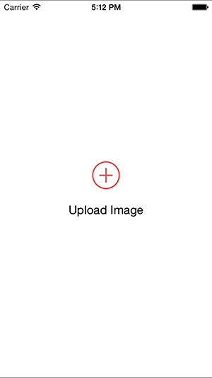

# CLPVerticalButton

Custom UIButton subclass to for vertical (image text) layout;



## Usage

To enable vertical mode 

```objective-c
CLPVerticalButton * button = [[CLPVerticalButton alloc] init];
button.verticalMode = YES;
```

or though Interface Builder


## Installation

To install it, simply add the following line to your Podfile:

```ruby
source 'https://github.com/alekoleg/AOSpec.git'

pod "CLPVerticalButton", '~> 0.0.1'
```

## Author

Alekseenko Oleg, alekoleg@gmail.com

## License

CLPVerticalButton is available under the MIT license. See the LICENSE file for more info.
